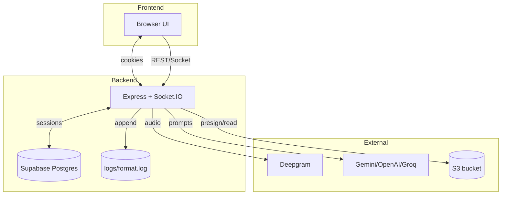
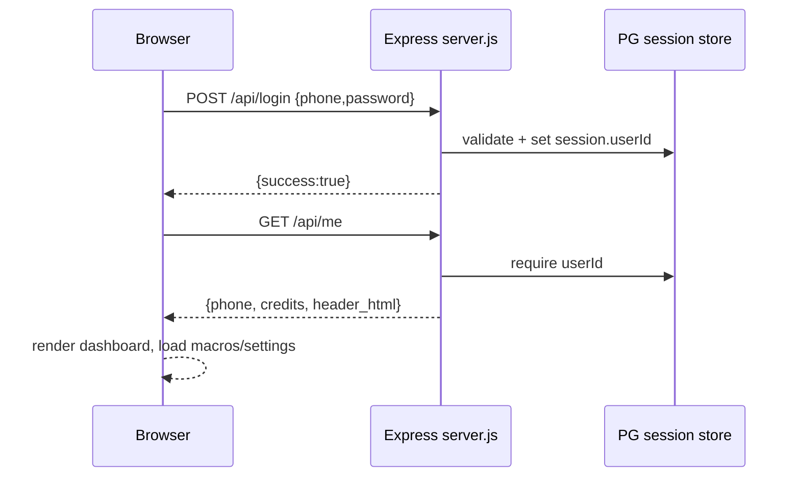
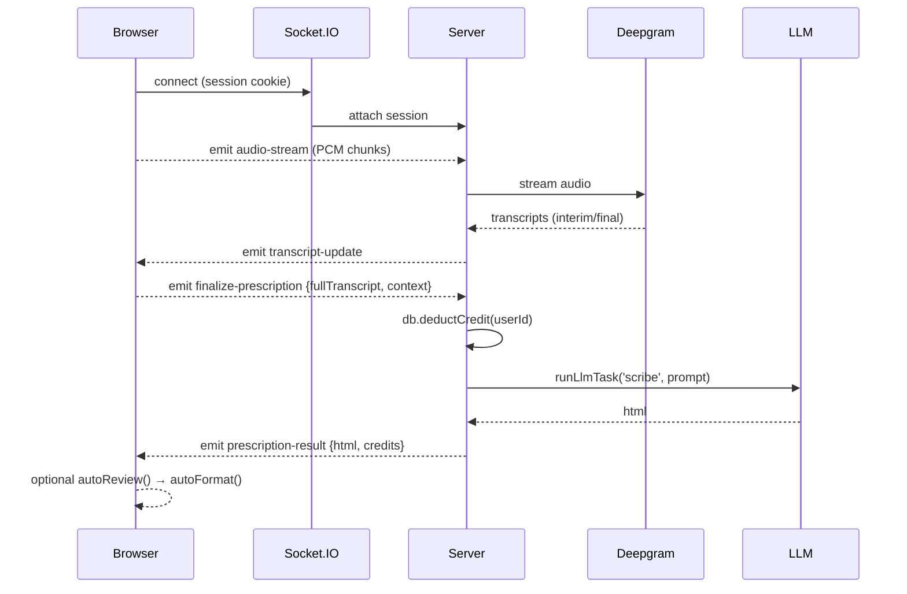
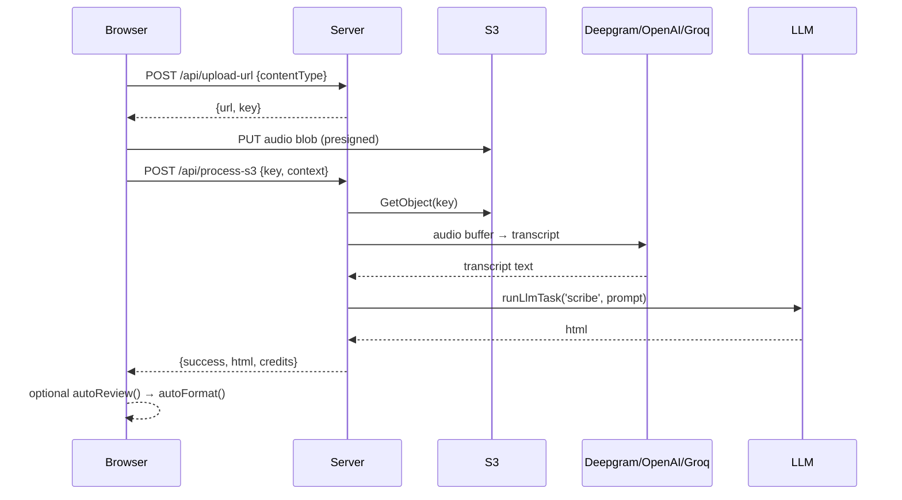
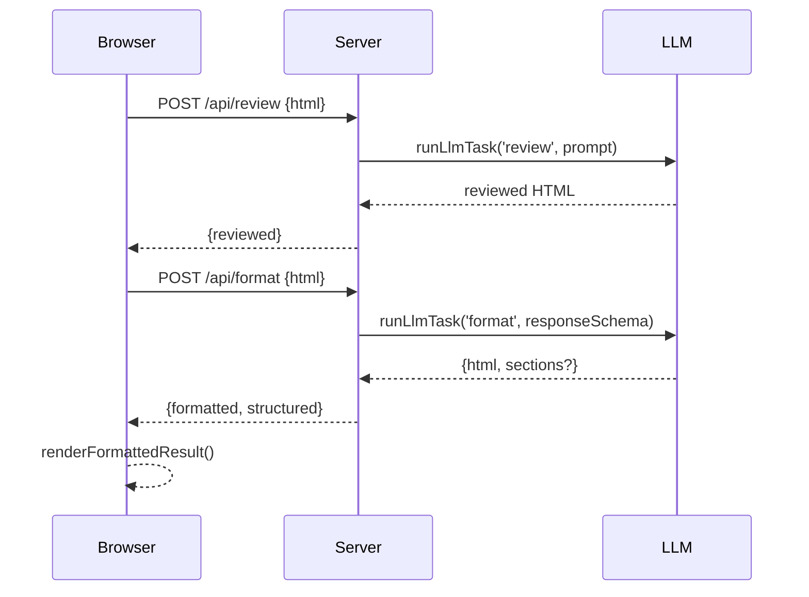

# Clinova Rx Architecture

This doc summarizes how the browser, Express server, external services, and data stores interact. Diagrams are Mermaid-compatible for quick rendering.

## Components
- **Browser (public/index.html, register.html)**: handles auth, live/offline recording, UI state, and calls REST + Socket.IO.
- **Express API (server.js)**: auth/session, scribe/review/format flows, settings/macros/admin, S3 presign/processing.
- **LLM/Transcription providers**: Deepgram (live/offline), Gemini/OpenAI/Groq (scribe/review/format).
- **Storage**: Supabase Postgres (users, macros, session via connect-pg-simple), S3 for audio uploads, local `logs/` for formatter traces.

## High-level Topology

## Auth + Dashboard Load

## Live Scribing (Socket.IO + Deepgram)

## Offline/Backup (S3 Upload → Process)

## Review + Format Post-processing

## Settings, Macros, Admin
- **Settings**: GET/POST `/settings` to load/save doctor profile + keywords.
- **Macros**: GET `/api/macros`, POST `/api/macros`, POST `/api/macros/delete`.
- **Header**: POST `/api/header` saves editable header HTML.
- **Admin**: POST `/api/admin/login`, GET `/api/admin/users`, POST `/api/admin/credits`, POST `/api/admin/remove-user` (guarded by `requireAdmin`).

## Notes
- Providers and models are controlled via env vars (`SCRIBE_PROVIDER`, `FORMAT_PROVIDER`, `TRANSCRIPTION_*`, etc.) with defaults in `services/providerConfig.js`.
- Logs: formatter pipeline appends to `logs/format.log` for observability.
- Safety: Helmet + rate limits; HTML sanitized before saving/returning.

## Rendered diagrams (SVG)
- docs/diagrams/auth-dashboard.svg
- docs/diagrams/live-scribing.svg
- docs/diagrams/offline-s3.svg
- docs/diagrams/review-format.svg
